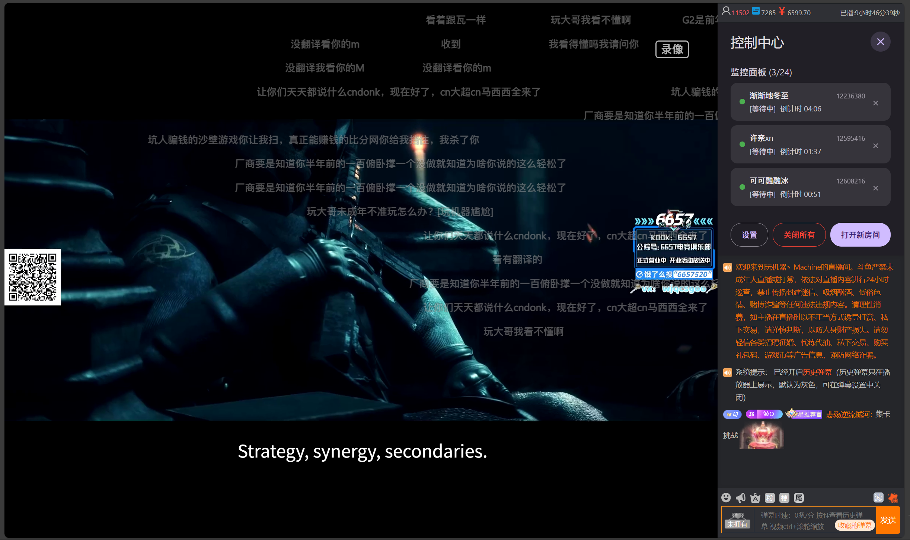
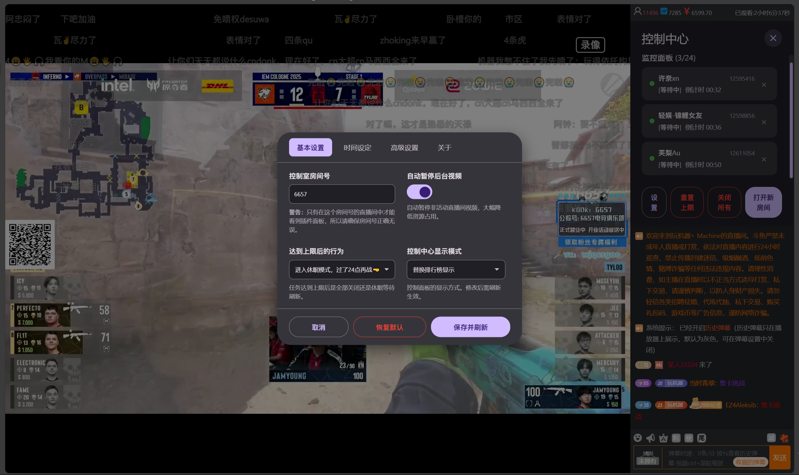

# 斗鱼全民星推荐Pro

- 用于自动领取斗鱼【全民星推荐】活动红包的油猴脚本
- 本脚本基于 [ysl-ovo 的原版脚本](https://greasyfork.org/zh-CN/scripts/532514-%E6%96%97%E9%B1%BC%E5%85%A8%E6%B0%91%E6%98%9F%E6%8E%A8%E8%8D%90%E8%87%AA%E5%8A%A8%E9%A2%86%E5%8F%96) 进行二次开发，在保留核心功能的基础上，重构了整体架构并新增了可视化管理面板与统计等附加功能

> [!WARNING]
> 项目作者的测试账户也已被斗鱼活动封控，本 Beta 版本不保证功能能够正常使用。自动领取即使数量不多也可能触发限制；项目只能提示疑似风控，不会自动停止领取，也无法保证账号安全。

## 下载

---
## 关于斗鱼新版界面的说明
斗鱼已更新直播间界面，当前发布包只包含星推荐抢红包功能：

- **侧栏模式**：原“替换排行榜”已升级为“侧栏模式”，使用右侧完整上半区；斗鱼重绘节点后会自动重新挂载。
- **星推荐任务**：工作直播间只在后台短暂打开以获取必要信息，随后自动关闭，不再长期占用标签页。
- **弹幕助手**：相关源码仍在开发中，当前不构建、不打包进发布脚本。
 
如有问题欢迎发[issue](https://github.com/ienone/douyu-qmx-pro/issues/new)反馈。
---

## 红包领取链路

当前代码只使用服务端状态机领取红包：

1. `square/list` 发现候选房间，再有限并发查询候选的匿名 `room/list`，按金币与星光棒奖池总量从高到低建立房间队列。
2. 通过 `room/list` 锁定奖池最大的 `rid/id/code`，在后台短暂打开目标直播间约 3 秒后关闭。
3. 根据 `waitSec` 安排最多 5 次 `snatch`。90/300/600 秒红包的首次尝试分别约在开页后 45/200/400 秒，后续请求集中在标称结束时间附近并至少间隔 10 秒。
4. `waitSec` 只用于粗略调度；真正可领状态仍以 `snatch` 响应为准。
5. `12006` 表示尚未开放，`error=0` 表示成功，单次 `12001` 或 `status=3` 按已派完处理。若 30 分钟内连续 3 个不同红包都在首次请求返回 `12001`，只显示“疑似账户风控”，不会停止领取。
6. DOM 弹窗点击兼容路径已经删除，接口异常或鉴权失败会直接记录为异常，不会静默切换领取方式。

DevTools 日志统一使用 `[领取路径:SNATCH]`，统计页以 `API` 标记领取来源。日志不会输出红包 `code`、Cookie 或 CSRF token。

## 用户界面 (UI)

---

## ✨ 相较于原版的改进

1.  改用“控制中心”模式

    在一个固定控制页面（例如 6657）统一发现、绑定和领取红包。目标直播间完成短时初始化后即关闭，后续请求由控制页执行。

2.  增加了一个可视化面板

    控制页显示正在运行的领取任务，并可横向切换到独立统计页面。

3.  减少后台资源占用

    不再依赖长期后台标签页、页面倒计时或 DOM 点击，避免后台冻结直接影响领取链路。

4.  提供了图形化设置

    发布包仅提供星推荐和关于页面；弹幕助手完成调试后再恢复构建。

## ⚙️ 设置详解

通过点击控制面板上的【设置】按钮，可以打开详细的配置界面。

### 星推荐
| 设置项 | 说明 |
| :--- | :--- |
| 控制室房间号 | 插件 UI 的入口点，支持靓号和普通房间号。保存时会自动解析并保存隐藏的真实 RID，用户无需维护第二房间号。 |
| 达到上限后的行为 | `停止所有任务` 或 `休眠并等待次日恢复`。|
| 控制中心显示模式| `浮动窗口`: 可拖拽的独立窗口。 `屏幕居中`: 固定的居中模态框。 `侧栏模式`: 面板会使用直播间右侧完整上半区，保留底部官方弹幕输入。 |

### 关于

显示版本、领取链路说明、统计数据来源、鉴权提示和项目链接。日夜切换与设置入口已移到控制中心顶部栏。

领取轮询、候选数量、API 重试等实现参数属于内部策略，不在设置页暴露。

---

## 🔨 开发者
本次重构使用vite对脚本进行解耦，增强开发体验，并使其能支持更多框架

初始插件: [vite-plugin-monkey](https://github.com/lisonge/vite-plugin-monkey/blob/main/README_zh.md)

#### 如何使用

- 安装依赖
`npm install`

- 开发模式
`npm run dev`

- 构建
`npm run build`  只生成抢红包脚本：`dist/星推荐v2-beta.user.js`

- 如需修改脚本头部注释
请修改 `vite.config.js`

---

## 📖 关于 (About)

#### 致谢
- 本脚本基于 [ysl-ovo](https://greasyfork.org/zh-CN/users/1453821-ysl-ovo) 的插件 [《斗鱼全民星推荐自动领取》](https://greasyfork.org/zh-CN/scripts/532514-%E6%96%97%E9%B1%BC%E5%85%A8%E6%B0%91%E6%98%9F%E6%8E%A8%E8%8D%90%E8%87%AA%E5%8A%A8%E9%A2%86%E5%8F%96) 进行功能改进与界面美化，同样遵循MIT许可证开源。感谢原作者的分享。
-  [v2.0.5](https://github.com/ienone/douyu-qmx-pro/releases/tag/v.2.0.5)更新中的“适配新版 UI”功能由 [@Truthss](https://github.com/Truthss) 在 [#5](https://github.com/ienone/douyu-qmx-pro/pull/5) 中贡献，非常感谢！
#### 一些Tips
*   页面倒计时不参与领取决策，真正领取状态以 `snatch` 的服务端返回为准
*   工作直播间只需短暂打开以获取必要信息，不需要常驻后台
*   自动领取存在明显风控风险；疑似风控提示不会代替用户停止任务
*   每天大概1000左右金币到上限
*   注意这个活动到晚上的时候，100/50/20星光棒的选项可能空了(奖池对应项会变灰)这时候攒金币过了12点再抽，比较有性价比
*   脚本还是bug不少，随缘修了＞︿＜
*   服务端领取成功后会直接使用响应中的奖品列表更新任务状态
#### 源码与社区

*   可以在 [GitHub](https://github.com/ienone/douyu-qmx-pro/) 查看本脚本源码。
*   发现BUG或有功能建议，欢迎提交 [Issue](https://github.com/ienone/douyu-qmx-pro/issues)（不过大概率不会修……）。
*   如果你有能力进行改进，非常欢迎提交 [Pull Request](https://github.com/ienone/douyu-qmx-pro/pulls)！

## 📄 License

本脚本使用 [MIT License](https://opensource.org/licenses/MIT) 授权

---
